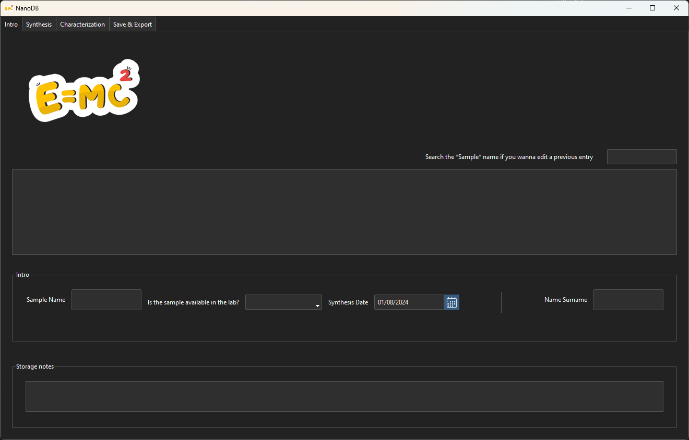
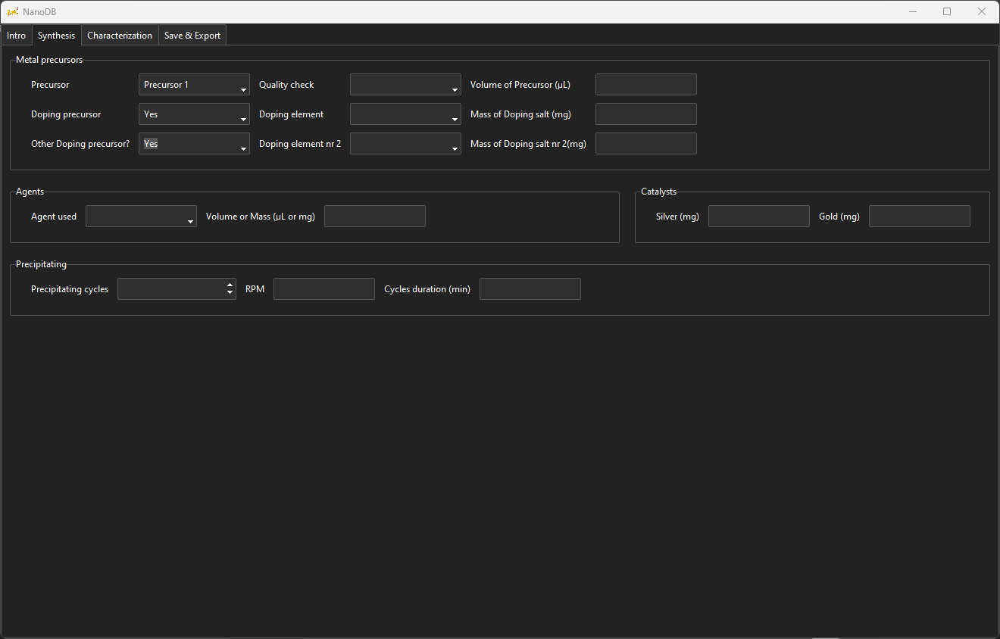
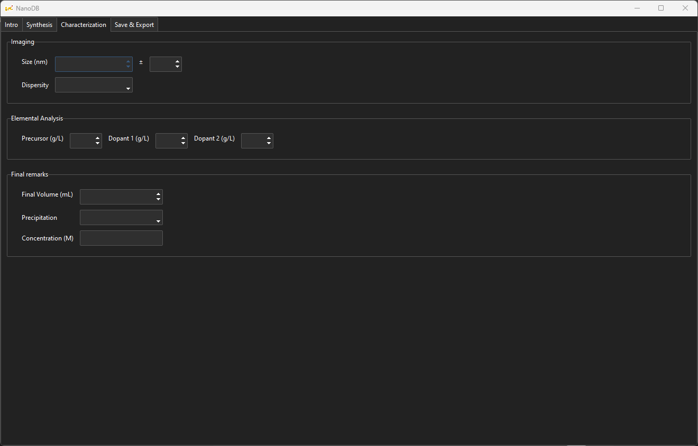
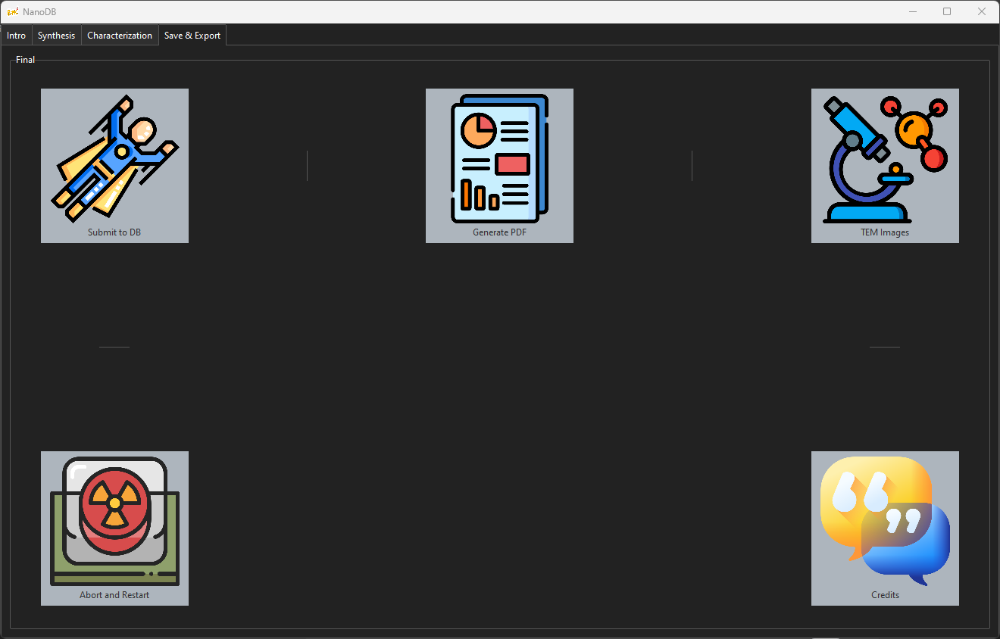
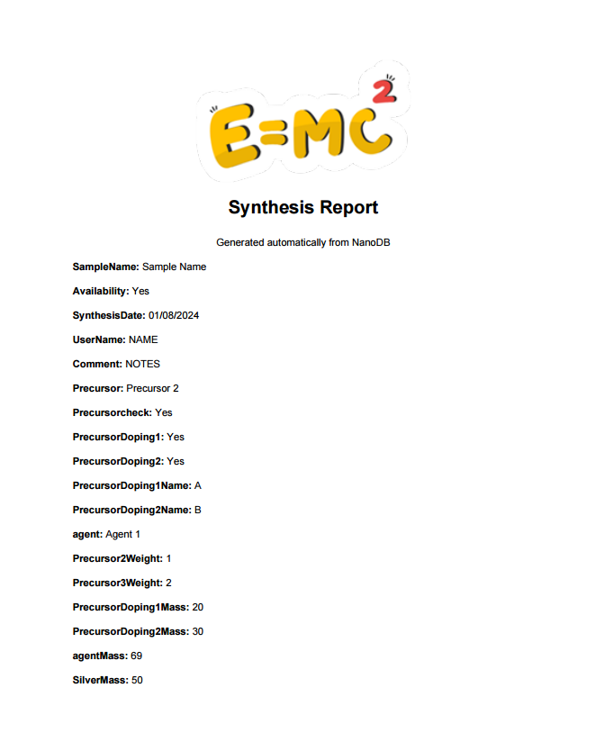

## Screenshots

Here are some screenshots of the NanoDB application in action:
*The main interface of the NanoDB application, showcases the four primary tabs.*

### Intro Tab

*The Intro tab where users can input basic sample information.*

### Synthesis Tab

*The Synthesis tab for entering detailed synthesis parameters.*

### Characterization Tab

*The Characterization tab where characterization results are recorded.*

### Save & Export Tab

*The Save & Export tab for saving data and generating reports.*

### Example PDF Report

*An example of a PDF report generated by the application.*
